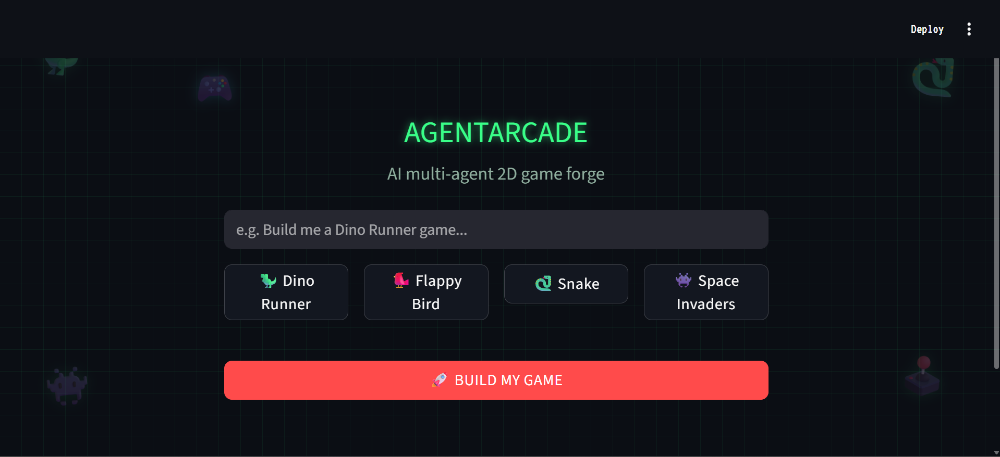
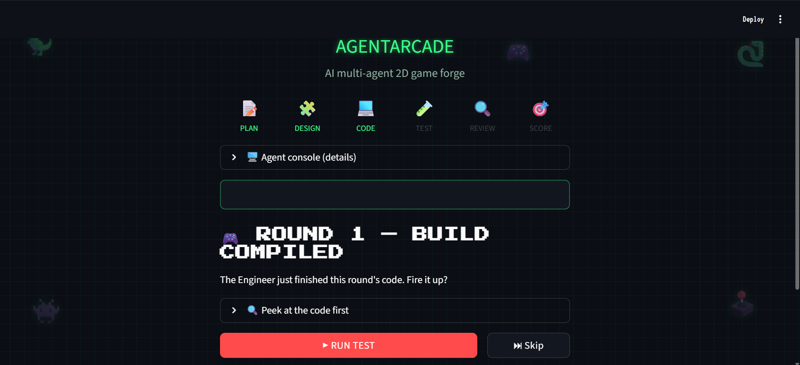
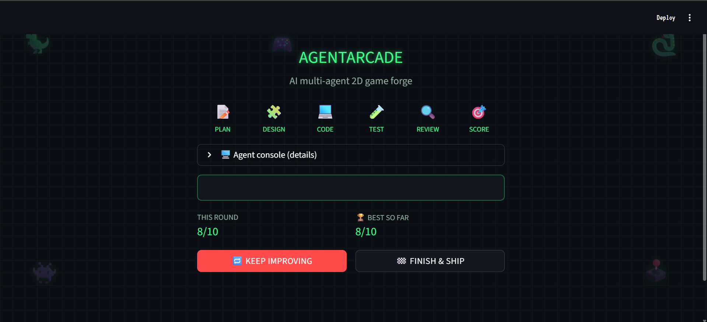
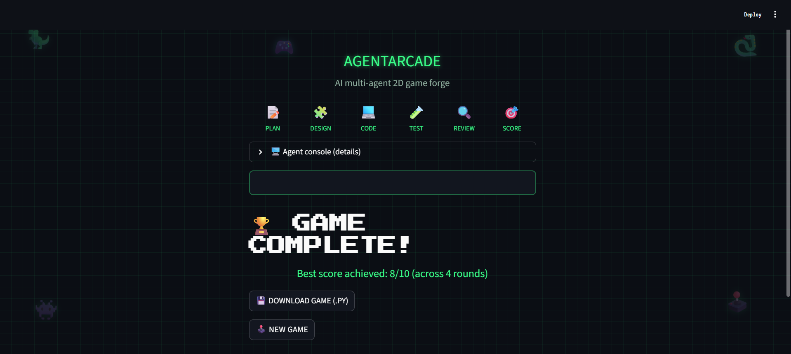
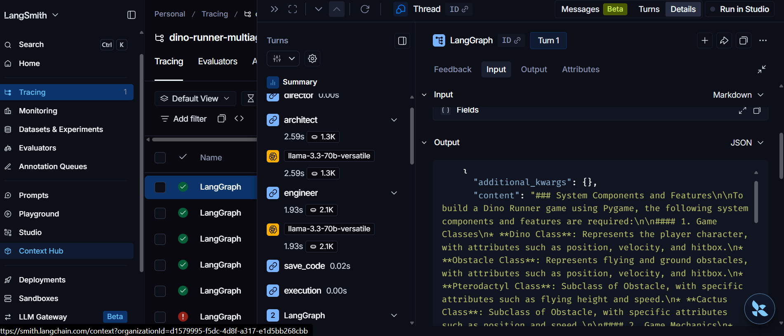
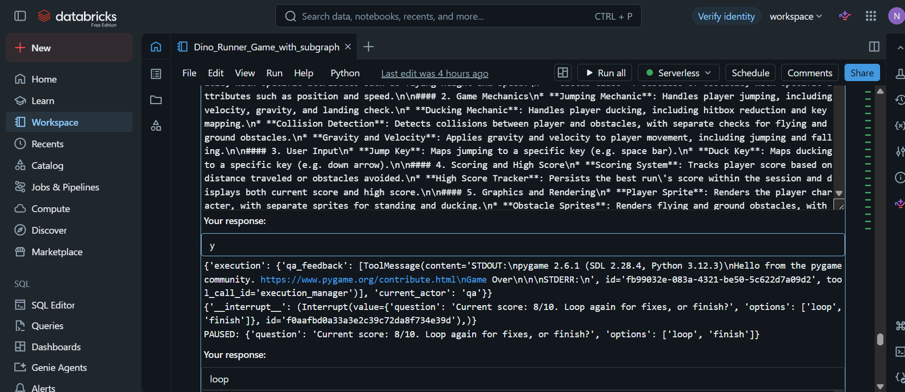

# 🕹️ AgentArcade

**A squad of AI agents designs, codes, tests, and refines a 2D Python game from your one-line idea — with a human approval checkpoint before any AI-generated code actually runs.**

🔗 **Live demo:** [agentarcade-yeqyonneqgquxlw8fwxwvh.streamlit.app](https://agentarcade-yeqyonneqgquxlw8fwxwvh.streamlit.app/)


---

## What is this?

AgentArcade takes a one-line game idea — *"build me a Dino Runner"*, *"build me a Snake game"* — and runs it through a pipeline of specialized AI agents that behave like a small software team: one plans the architecture, one writes the code, one tests it, one scores it, and a human (you) approves execution and decides when to stop iterating.

Under the hood, this is a general-purpose **spec → design → code → run → review → iterate** loop built on [LangGraph](https://github.com/langchain-ai/langgraph). It's shipped here as a game builder because that makes for the clearest, most verifiable demo — but the same graph structure generalizes to other small, testable Python programs (utility scripts, CLI tools, algorithm practice). See the [Databricks notebooks](./Databricks_Langgraph/README.md) for the original notebook implementation and an advanced "QA Subgraph" extension.

---

## Screenshots

**The app in action:**

| | |
|---|---|
|  |  |
|  |  |

**Under the hood — traced in LangSmith and developed in Databricks:**

| | |
|---|---|
|  |  |

---

## How the pipeline works

Every request flows through **7 nodes**. Four of them call an LLM; the other three are plain Python (file I/O, subprocess execution, human-in-the-loop routing).

```
 Director → Architect → Engineer → Save Code → Execution → QA → Scorer
                             ▲                      │           │
                             │                      ▼           ▼
                             └──────── loop? ── Human Review (approve/score)
```

| Node | Uses an LLM? | What it does |
|---|---|---|
| **Director** | No | Packages the game request (and, for the built-in quick-picks, the exact required features) as the pipeline's starting input. |
| **Architect** | Yes | Reads the request and breaks it into a system design — player class, obstacle spawner, collision detection, scoring, etc. |
| **Engineer** | Yes | Writes the actual Python/pygame code from the design. On later iterations, reads the previous code plus QA feedback and makes *targeted* fixes rather than rewriting from scratch. |
| **Save Code** | No | Writes the Engineer's latest code to disk. |
| **Execution** | No | **Pauses for your explicit approval**, then runs the saved code as a subprocess to see if it actually works — crash, timeout (expected/healthy for a real game loop), or clean exit are all captured. |
| **QA** | Yes | Reads the code, the original requirements, and the execution output, and diagnoses concrete bugs or missing features in plain English. Does not write fixes itself. |
| **Scorer** | Yes | Converts QA's diagnosis into a single 1–10 score using a fixed rubric, so iterations are comparable. |
| **Human Review** | No | A conditional edge that pauses again after scoring: you decide whether to loop back to the Engineer for another pass, or finish and download the result. |

**Why the human checkpoints matter:** AI-generated code is never executed automatically. The graph pauses via LangGraph's `interrupt()` before running anything, and again before deciding whether to iterate further — nothing happens without your explicit input at either point.

---

## Repo structure

```
AGENTARCADE/
│   .env                     — your local secrets (never committed)
│   .gitignore
│   app.py                   — the Streamlit app (this is what's deployed live)
│   packages.txt             — system-level deps for Streamlit Cloud (pygame/SDL)
│   requirements.txt         — Python deps
│   README.md                — you are here
│
├───Databricks_Langgraph/    — original notebook implementation + advanced extension
│       README.md            — setup + architecture notes specific to this folder
│       ...
│
└───screenshots/             — screenshots used in this README
```

---

## Running it yourself

### 1. Clone and install

```
git clone https://github.com/<your-username>/AgentArcade.git
cd AgentArcade
pip install -r requirements.txt
```

### 2. Set your API key

Create a `.env` file in this folder (same level as `app.py`):

```
GROQ_API_KEY=your_groq_key_here
```

Optional, if you want LangSmith tracing of each run:

```
LANGCHAIN_API_KEY=your_langsmith_key_here
```

> Get a free Groq key at [console.groq.com](https://console.groq.com/keys).

### 3. Run locally

```
streamlit run app.py
```

Opens at `http://localhost:8501`.

---

## Tech stack

- **[LangGraph](https://github.com/langchain-ai/langgraph)** — the multi-agent state machine
- **[Groq](https://groq.com/)** running **Llama 3.3 70B** — the LLM powering Architect/Engineer/QA/Scorer
- **[Streamlit](https://streamlit.io/)** — the web frontend
- **[LangSmith](https://smith.langchain.com/)** — tracing/observability for each pipeline run
- **pygame** — the framework the generated games are written in

---

## Related

- [`Databricks_Langgraph/`](./Databricks_Langgraph/) — the original notebook-based implementation this app was built from, including an advanced **QA Subgraph** extension (splits QA into syntax-check → logic-check → score as its own nested graph). See that folder's README for notebook-specific setup and architecture notes.